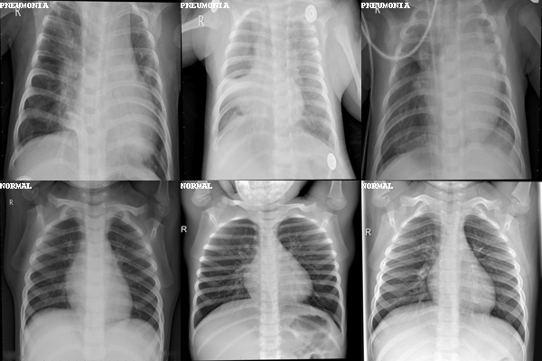

# Using Huggingface to fine tune models


In this repo I use HuggingFace to load pre-trained models and their respective preproccesses to fine tune new datasets with higher accuracy and lower computing cost. By using a vision transformer, I am able to load a dataset of X-Ray scans and predict whether the patient has Pneumonia or not. 

## Loading Pre-Trained Models

```
image_processor = AutoImageProcessor.from_pretrained("google/vit-base-patch16-224")
model = ViTForImageClassification.from_pretrained("google/vit-base-patch16-224")
```
The Vision Transformer (ViT) model for image classification is an improvement to traditional convolutional neural networks (CNNs) by applying transformers to computer vision tasks. The model, introduced in the paper "An Image is Worth 16x16 Words: Transformers for Image Recognition at Scale" by Alexey Dosovitskiy et al., uses a pure transformer applied directly to sequences of image patches for classification tasks. 

## Loading Data and Pre-Processing it 

```
ds = load_dataset("trpakov/chest-xray-classification", name="full")

def transform_batch(example):
    
    inputs = processsor([image for image in example['image']], return_tensors='pt')
    
    inputs['labels'] = example['labels']
    
    return inputs

prepared_ds = ds.with_transform(transform_batch)
```
Using a batch transform, this data will be processed by the image processor as it is called, rather than using a function and mapping it across the entire dataset which would be slow and computationally costly. 

<p align="center">
  
</p>


## Creating Trainer Instance

```
from transformers import TrainingArguments
from transformers import Trainer

training_args = TrainingArguments(
  output_dir="./vit-base-X-Ray",
  per_device_train_batch_size=16,
  evaluation_strategy="steps",
  num_train_epochs=4,
  fp16=False,
  save_steps=100,
  eval_steps=100,
  logging_steps=10,
  learning_rate=2e-4,
  save_total_limit=2,
  remove_unused_columns=False,
  push_to_hub=False,
  report_to='tensorboard',
  load_best_model_at_end=True,
)
trainer = Trainer(
    model=model,
    args=training_args,
    data_collator=collate_fn,
    compute_metrics=compute_metrics,
    train_dataset=prepared_ds["train"],
    eval_dataset=prepared_ds["validation"],
    tokenizer=processsor,
)

***** eval metrics *****
  epoch                   =        1.0
  eval_accuracy           =     0.9734
  eval_loss               =     0.0776
  eval_runtime            = 0:00:24.77
  eval_samples_per_second =     47.015
  eval_steps_per_second   =      5.892

```


